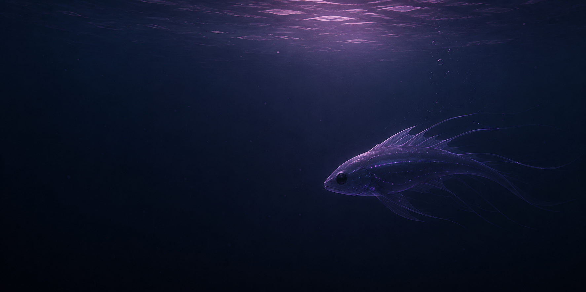

# Fauna

*A living ecosystem for Kerbal Space Program.*

State-machine driven creatures with behaviour, needs and environmental interaction.

*(yes, fish in laythe, not only fish tho.)*

 

## Overview

Fauna is an experimental ecosystem simulation for Kerbal Space Program.

Instead of scripted behaviour, every creature is driven by a modular state machine that allows it to perceive, decide and interact with the world.

The long-term goal is to create believable wildlife that naturally adapts to different environments and situations.

## Features

- Modular state-machine AI
- Autonomous ecosystem simulation
- Environmental awareness
- Needs-based behaviour
- idk more, ill think about it later

This project is actively being developed.
Documentation and examples will be published as development progresses.
